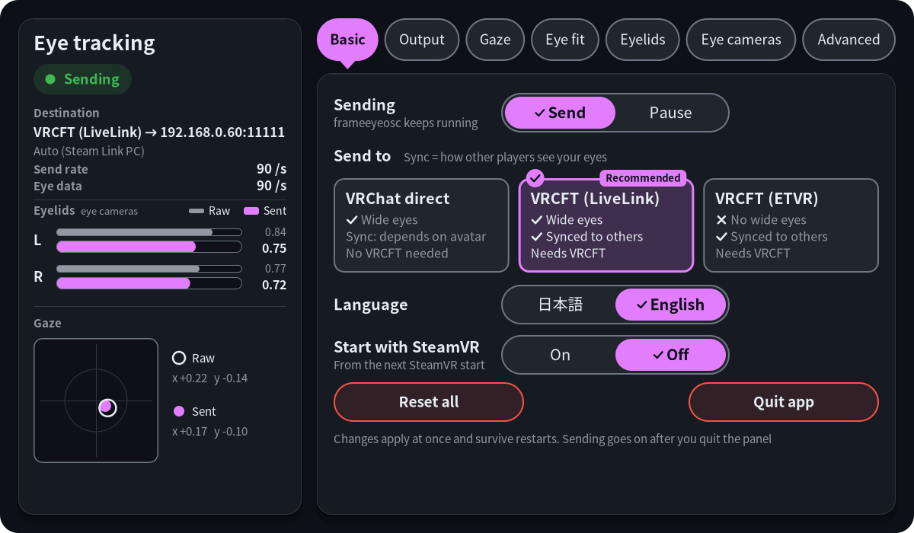
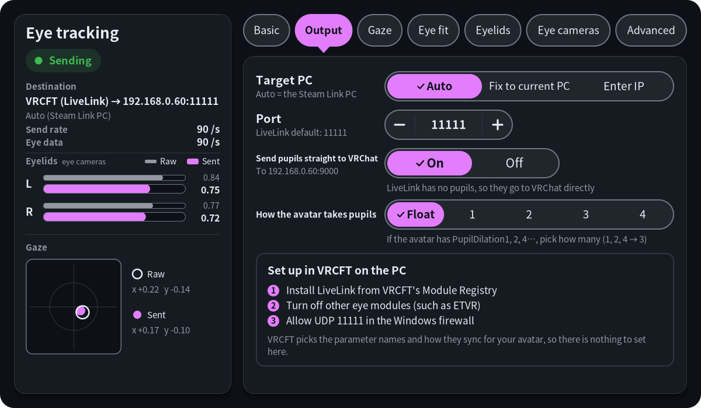
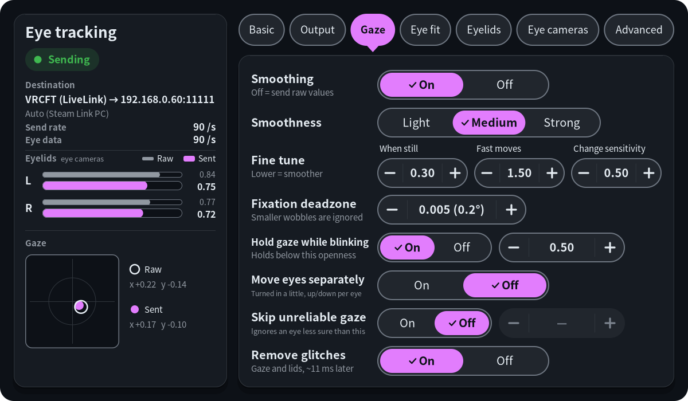
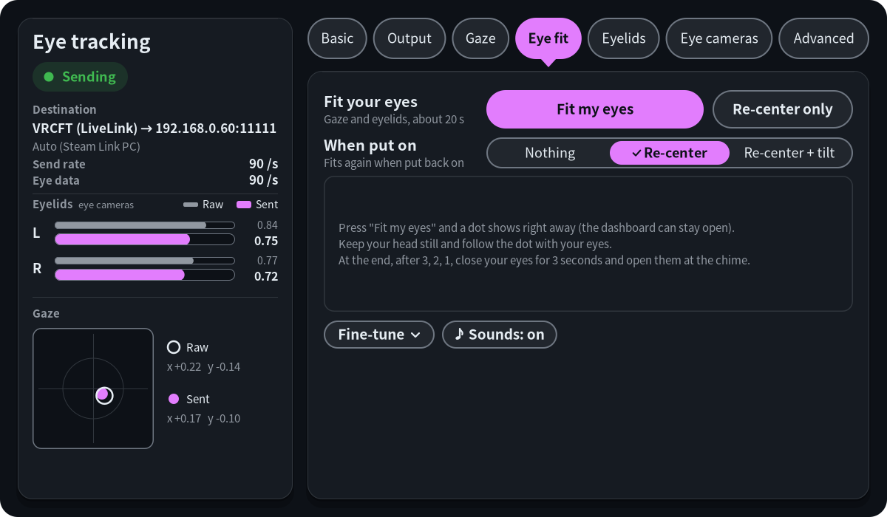
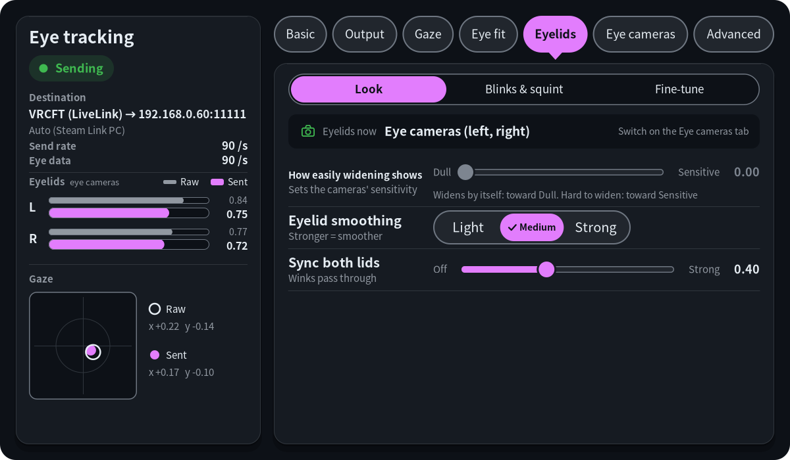
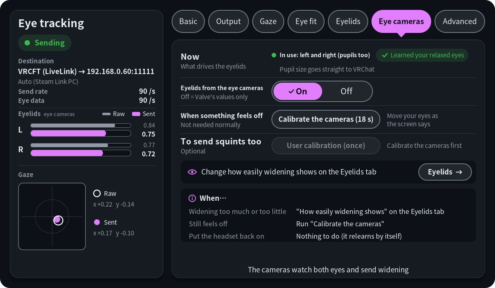
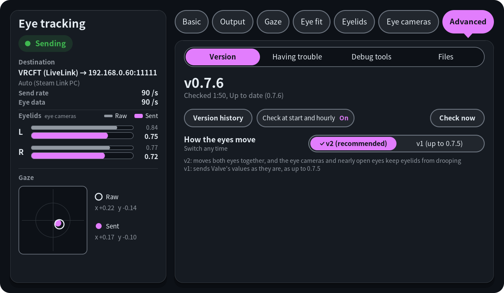

# frameeyeosc

Sends the Steam Frame's eye tracking (gaze and eye openness) to VRChat over OSC, as VRCFaceTracking-style avatar parameters. It runs on the headset as a background service and works with PC VRChat streamed through Steam Link. It can also send to VRCFaceTracking on the PC, so the eyes can be combined with other trackers.

[日本語版はこちら](README.ja.md)

https://github.com/user-attachments/assets/f8969485-161b-40d4-b9e4-689dee6d1955

This is a fork of [konsti219/frameeyeosc](https://github.com/konsti219/frameeyeosc). The Frame's public APIs only give you a combined gaze direction. konsti219 found that the eye tracker also measures how open each eye is and keeps it in an internal shared-memory object (`/dev/shm/eye-server.mmap`), and that is where this tool reads it from.

The way the eye-camera tool finds the eye camera frames is ported from Curtis English's [FrameEyeCameraFeed](https://github.com/Curtis-VL/FrameEyeCameraFeed) (MIT); thank you.

## What this fork adds

- It finds your PC on its own by sending to whichever PC Steam Link is streaming from. With the bundled wireless adapter that's the adapter's direct link, so your home network doesn't matter.
- Gaze and eyelids are smoothed with One Euro filters. A small deadzone keeps the eyes still while you fixate, and the gaze is held while your eyes are shut, because the Frame's gaze jumps as the eyes reopen.
- Both eyes share one gaze. On the Frame each eye's gaze wobbles on its own, which makes an avatar's eyes twitch. `--independent-eyes` turns the eyes in a little toward each other instead (as if looking about 2 m away), each keeping its own up/down; the Frame's own per-eye sideways gaze is too unsteady to send as it is.
- Eyelid values are mapped onto the VRCFT scale (0 closed, 0.75 relaxed, 1 widened). A held-shut eye reads about 0.2 on the Frame, and a relaxed eye wanders between about 0.75 and 0.9.
- Eyelids calibrate themselves. It learns how far each of your eyes opens when relaxed, so if your face or the headset fit makes one eye look more open, the avatar still looks even. Winks still come through.
- It runs as a service that starts with SteamVR and restarts if it stops.
- Settings live in a file that is picked up while running, and an optional panel on the SteamVR dashboard changes them from inside the headset.
- It can send in the format the ETVR Tracking Module for VRCFaceTracking reads (see [VRCFaceTracking (ETVR) mode](#vrcfacetracking-etvr-mode)), or as Live Link Face packets for VRCFaceTracking's LiveLink module, which also carries widened eyes (see [VRCFaceTracking (LiveLink) mode](#vrcfacetracking-livelink-mode)).
- Optionally it also uses the Frame's eye cameras, through eyecam, a tool that comes with it: widened eyes come through again on SteamOS 0.4.3, and squints and pupil size are sent too. It takes a one-time setup on the panel (see [Eye cameras](#eye-cameras)).

## Compared with Steam Link's own OSC

https://github.com/user-attachments/assets/200526ab-4733-4072-8230-8d83ea14653d

SteamVR's Steam Link can send eye tracking over OSC by itself (`LeftEyeX`, `LeftEyeLid`, ...). Compared on the same eye recording (SteamVR 2.18.2):

| | frameeyeosc 0.7.2 | SteamVR's own OSC |
|---|---|---|
| Gaze | Can turn the eyes in a little ("move eyes separately": as if looking about 2 m away) | One gaze for both eyes |
| Gaze smoothing | One Euro smoothing, strength selectable | None (raw values) |
| Eyelids | Each eye's relaxed open lined up; blinks held, left/right synced | Raw openness turned over (in 1/254 steps) |
| Blinks and winks | Yes | Yes |
| Widened eyes | Yes, with the eye cameras (SteamOS 0.4.3 too) | No |
| Pupil size | Yes, with the eye cameras: smaller in bright places, bigger in the dark | No |
| Squints | Yes, with the eye cameras after the optional user calibration | No |
| Setup | Install on the Frame (the eye cameras also take a one-time sudo step) | Nothing to install: a SteamVR setting and a VRCFaceTracking module |

The video shows the avatar's eyes in VRChat with the eye cameras in use. See [Eye cameras](#eye-cameras) for the setup.

## Requirements

- A Steam Frame with Developer Mode on and SSH access (Settings > System > Developer Mode, then set a password under Developer). Choose a strong password: with SSH on, anyone on your network who knows it can log in to the headset.
- PC VRChat streamed with Steam Link, OSC enabled in VRChat (Action Menu > Options > OSC > Enabled).
- An avatar with VRCFaceTracking eye parameters (`FT/v2/EyeLeftX`, `EyeLidLeft`, ...) as floats. Avatars that pack parameters into binary bits are not supported when sending to VRChat directly, except for the eye cameras' pupils (see [Pupils on avatars with bit parameters](#pupils-on-avatars-with-bit-parameters)). frameeyeosc also sends `EyeTrackingActive` as a bool; some avatars declare it as a float and stop tracking on a bool. For those, choose "Float" under "EyeTrackingActive type" on the Output tab (`eye_tracking_active`), or "Off" to not send it at all. Avatars set up for the OSC that SteamVR's Steam Link sends by itself (`LeftEyeX`, `RightEyeLid`, ...) work too: turn on "Steam Link names too" on the Output tab (see [Avatars made for Steam Link's OSC](#avatars-made-for-steam-links-osc)). Avatars without these parameters can follow your eyes through VRChat's own eye tracking input instead (see [Native VRChat eye tracking](#native-vrchat-eye-tracking)).
- For the VRCFaceTracking (ETVR) mode: VRCFaceTracking on the PC with the ETVR Tracking Module. For the LiveLink mode: VRCFaceTracking with the LiveLink module.

## Install

### Easiest: install right inside the Frame (recommended)

No PC needed. In Konsole on the Frame (+ on the bar at the bottom → the list of programs → Konsole), type this command, press Enter, and pick **1** (frameeyeosc) from the menu. It asks whether to install the dashboard panel too.

```sh
curl -fsSL https://frame.sasaken1102s.net | sh
```

- Do this once first: Steam Settings → System → turn on "Enable Developer Mode" (while it's off, Konsole doesn't show up in the + list).
- The other apps (frame-jp-keyboard, frame-mic-tuner, frame-perf-overlay) can be installed from the same menu.
- To update, run the same command and pick the same number again. To uninstall, use `u` in the menu.
- Step-by-step guide and video: https://frame.sasaken1102s.net
- To install without any prompts: `curl -fsSL https://frame.sasaken1102s.net | sh -s -- install eye`

What gets installed and the options are the same as in "Install from a PC" below (it runs `install.sh` for you). After installing, don't forget to turn off Steam Link's OSC output as described below.

### Install from a PC

Download the tarball from the releases page and copy it to the headset, for example from your PC:

```sh
scp frameeyeosc-*-steamframe-aarch64.tar.gz steamos@<headset-ip>:
```

Then on the headset (`ssh steamos@<headset-ip>`):

```sh
tar xzf frameeyeosc-*-steamframe-aarch64.tar.gz
cd frameeyeosc
./install.sh               # frameeyeosc only
./install.sh --with-panel  # frameeyeosc and the dashboard panel
```

No sudo is needed. Everything goes into your home directory (`~/.local/bin`, `~/.local/lib/eyecam`, `~/.config`, `~/.local/share`), so SteamOS updates don't remove it. Run the same command again to update. Without `--with-panel` an installed panel is left as it is.

The release also installs eyecam, the eye-camera tool, to `~/.local/lib/eyecam` and, on its first install, enables and starts it as a user service (`eyecam.service`). Updates restart it only if it is running, and leave it off if you turned it off (see [Turning it off and removing it](#turning-it-off-and-removing-it)). Until you set up the eye cameras on the panel (see [Eye cameras](#eye-cameras)) it only waits, and nothing changes. That setup is the only step that asks for sudo, once, and you run it yourself; `install.sh` never does.

After that, turn off Steam Link's own OSC output on your PC (SteamVR settings > Steam Link > OSC). Steam Link sends its own unsmoothed eye data to VRChat, and with both running, two sources fight over the avatar's eyes. This is needed in the ETVR and LiveLink modes too, where VRCFaceTracking drives the avatar's eyes.

#### Updating from a version before 0.4.0

Versions before 0.4.0 have no updater, so update to 0.4.0 once by hand: copy and unpack the new tarball as above and run `./install.sh --with-panel` (or `./install.sh` without the panel). Your `~/.config/frameeyeosc/env` and the learned eyelid calibration are kept, and the service restarts on the new version.

Options in `FRAMEEYEOSC_ARGS` in `env` still work as before. But anything set there is locked in the panel ("Locked by command line"). To change it from the panel, remove it from `env`, run `systemctl --user restart frameeyeosc`, and set the value again in the panel.

To remove it: `./install.sh --uninstall` (removes the panel too; add `--purge` to also delete settings and calibration).

#### Updating from the panel (0.4.0 and later)

From 0.4.0 on, the panel's "Update" button does the update. The panel's Advanced tab shows the installed version on its "Version" page. At start and then every hour, the panel asks GitHub whether a newer release exists. "Check now" asks right away. When a newer release exists, the "Version" page shows its summary in a box under the version (in Japanese on a Japanese panel when the release has one), and the left column shows a notice that opens that page, and "Update" downloads it, checks it against the release's `SHA256SUMS`, and runs its `install.sh` with the options of your last install (kept in `~/.config/frameeyeosc/install-args`). frameeyeosc and the panel restart on the new version. If anything fails before `install.sh` runs, nothing changes; the log is in `~/.cache/frameeyeosc/update.log`. Turn "Check for updates" off to stop the hourly check (the "Check now" button still works). The update itself only runs when you press the button.

`SHA256SUMS` is a checksum file from the same release, not a signature. It catches a corrupted or incomplete download. It can't catch a release that was replaced on GitHub, because the checksum would be replaced along with it.

## Panel

`./install.sh --with-panel` adds an "Eye" panel to the SteamVR dashboard. It starts together with SteamVR from the next SteamVR start; to open it right away, pick "frameeyeosc panel" under Launch program (+) on the dashboard.

| Basic | Output |
|---|---|
|  |  |
| **Gaze** | **Eye fit** |
|  |  |
| **Eyelids** | **Eye cameras** |
|  |  |
| **Advanced** | |
|  | |

- The left column always shows what frameeyeosc is doing: sending or paused, where it sends to, messages per second, how many samples a second the eye tracker delivers (marked "low" below 60, with a line under it saying whether frameeyeosc or the Frame was the slow one), both eyelids and the gaze (raw and sent), and a config error if there is one. While the "Track Dominant Eye Only" setting is on, the gaze title line says which eye the Frame tracks ("Frame setting: tracking the right eye only").
- Basic: pause sending, where to send (three cards: VRChat directly, VRCFT (LiveLink), marked recommended, and VRCFT (ETVR), each saying whether wide eyes come through, how others see your eyes, and whether VRCFaceTracking is needed), language (Japanese / English), start with SteamVR, reset all, quit.
- Output: target PC (automatic, fixed to the PC it sends to now, or typed: see below) and port. For VRChat directly also the parameter prefix, the EyeTrackingActive type, whether to send Steam Link's parameter names too and whether to move VRChat's own eyes too; for LiveLink and ETVR what to set up in VRCFaceTracking on the PC instead. With LiveLink and the eye cameras, also "Send pupils straight to VRChat" (`pupils_to_vrchat`); with the eye cameras, for VRChat directly and LiveLink, "How the avatar takes pupils" (`pupil_bits`).
- Gaze: smoothing on or off, light / medium / strong presets and the three filter values, deadzone, holding the gaze while blinking, per-eye gaze, skipping unreliable gaze, removing one-sample glitches.
- Eye fit: one button that fits your gaze and eyelids in about 20 seconds (see [Eye fit](#eye-fit)), fitting straight ahead again, what to fit by itself when you put the headset on ("When put on": nothing, re-center, or re-center + tilt), the result with "Reset", and the values by hand under "Fine-tune".
- Eyelids: three pages under a switch at the top (the first time "Look", then the one you opened last, also after the panel restarts). "Look": where the eyelids come from now (the eye cameras, one eye camera and Valve's values, or Valve's values), "How easily widening shows" (one slider from Dull to Sensitive: with the eye cameras it sets their widening sensitivity; with Valve's values it picks Off / Less / Normal / More (`lid_widen`) for eyes with an eye fit; on SteamOS 0.4.3 without the eye cameras, where a relaxed open eye already reads 1.0, a line saying Valve's values alone can't widen, with a button to the Eye cameras tab), eyelid smoothing (light / medium / strong), and how strongly both lids are synced (`lid_sync`). "Blinks & squint": making blinks visible (hold time), blinking both eyes together (`blink_sync_below`), and the lowest eyelid when narrowed (`camera_lid_floor`; it takes effect while an eye is on the cameras). "Fine-tune": the auto calibration and its learned values, per-eye scales, the four openness marks drawn over each eye's live openness (blink and open wide to set them; 3 and 4 greyed for fitted eyes and eyes on the cameras), "Treat nearly open as open" (`lid_open_snap`), and the two smoothing values.
- Eye cameras: shown while eyecam runs. Until they are set up, the setup checklist (see [Eye cameras](#eye-cameras)); then what drives the eyelids now, "Eyelids from the eye cameras" on or off, "Calibrate the cameras (18 s)" for when something feels off, the optional "User calibration (once)" for squints, and what to do when.
- Advanced: four pages under a switch at the top, "Version", "Having trouble", "Debug tools" and "Files" (the first time "Version", then the one you opened last, also after the panel restarts). "Version": the version with checking for and installing updates (and the automatic check on or off) and "Version history" (each version's summary and changes, newest first; one opens at a time, and the thumbstick or the up / down chevrons on the right scroll). "Having trouble": the Diagnostics page to send as a screenshot when stuck (see [Troubleshooting](#troubleshooting)), and the recent records of calibrations and eye fits (see below). "Debug tools": showing gaze dots and their distance, recording the eye log (see below), and while eyecam runs the "Developer" eye-camera recording for tuning the eye processing, which keeps the eye video in `~/eyecam/rec_…/` (about 2.5 GB each time; see [panel/README.md](panel/README.md)). "Files": file locations, frameeyeosc's PID, options locked by the command line.
- Records: every eye-camera calibration started from the panel and every eye fit (also the re-center run by itself when the headset is put on) leaves a small folder in `~/.local/state/frameeyeosc/reports/` (the newest 10 are kept): `summary.json` (what ran, how it ended and why, the versions, the diagnostic code, the conditions: dashboard open or closed, camera and eye-tracker rates, how long since the headset was put on), `status.jsonl` (frameeyeosc's and eyecam's status once a second while it ran), `logs.txt` (frameeyeosc's, the panel's and eyecam's journal and Valve's eye-tracker log from 15 seconds before it to its end, in time order, at most 300 KB), for calibrations `calib_result.json` (its numbers, never eye images) and `report.txt`. "Having trouble" lists the newest three ("All records" lists them all); "View" opens one: the reason, what happened in order, and the files. A failed fit or calibration says its log was saved, with "View record". Over SSH, `frameeyeosc-panel --report latest` prints the newest record's `report.txt` (`--report list` lists them, `--report <folder>` prints one); it works without SteamVR. Nothing is sent anywhere.

The panel writes `config.json` and reads the status file. To pick its default language, it also reads the `language` line of Steam's `~/.steam/registry.vdf` once at startup (read only). For updates it runs `~/.local/share/frameeyeosc/frame-update.sh` (see above). Closing it, quitting it, or not installing it doesn't stop frameeyeosc. While it isn't open on the dashboard it draws nothing. Besides running the update check, the only thing it reads then is the update state file (`~/.cache/frameeyeosc/update-state.json`), about twice a second. The exceptions are an eye fit (it then also reads the status file and shows the dot, with the dashboard open or closed, until the fit is over) and the debug gaze dots while they're switched on (it then listens on their socket and moves the dots about 90 times a second while samples arrive, and reads the status file and checks `config.json` for changes 10 times a second), and "When put on" while the gaze is fitted (it then reads the status file every 0.5 s while the dashboard is closed, to notice the headset being put on). Its "Start with SteamVR" switch enables or disables its systemd user unit (`frameeyeosc-panel.service`). Build notes and debugging options are in [panel/README.md](panel/README.md) (Japanese).

### Setting the target PC by hand

"Auto" sends to the PC Steam Link is streaming from. If that is the wrong PC, press "Enter IP" in the Target PC row on the Output tab. A keypad opens: type the PC's IPv4 address (for example `192.168.1.20`) and press "OK". Leave the port out; it goes in the Port row. The panel writes it to `host` in `config.json`, and the row shows "Manual 192.168.1.20". "Auto" switches back. To use a host name instead of an address, set `host` in `config.json` by hand; the row then shows "Manual" and the name, and "Auto" still switches back.

## Settings

Settings are in `~/.config/frameeyeosc/config.json`. The panel writes it, and you can also edit it by hand. frameeyeosc checks it 10 times a second and applies changes without a restart. Missing keys use the defaults and unknown keys are ignored. If the file is broken or a value is out of range, frameeyeosc keeps the previous settings and reports the error (in the panel and in the status file).

```json
{ "output": "vrchat", "gaze_min_cutoff": 0.3, "lid_sync": 0.6 }
```

| Key | Option | Default | What it does |
|---|---|---|---|
| `sending` | | `true` | `false` pauses sending (in VRChat mode `EyeTrackingActive=false` is sent once, as `eye_tracking_active` says; in LiveLink mode relaxed open eyes looking ahead) |
| `output` | `--output` | `"vrchat"` | `"vrchat"` sends avatar parameters to VRChat, `"etvr"` sends to VRCFaceTracking's ETVR Tracking Module, `"livelink"` sends Live Link Face packets to VRCFaceTracking's LiveLink module |
| `host` | `--target` | `"auto"` | `"auto"` = the PC Steam Link is streaming from, else an IP address or host name without a port |
| `port` | `--port`, `--target` | `null` | `null` = 9000 for `vrchat`, 8889 for `etvr`, 11111 for `livelink` |
| `prefix` | `--prefix` | `"/FT"` | Parameter name prefix; `""` for none. In LiveLink mode only used for the pupils sent straight to VRChat (`pupils_to_vrchat`) |
| `eye_tracking_active` | `--eye-tracking-active` | `"bool"` | How `EyeTrackingActive` is sent in VRChat mode: `"bool"` (true / false), `"float"` (1.0 / 0.0; some avatars need it) or `"off"` (never, not even the one-time "not active" on pausing or losing tracking). ETVR and LiveLink modes never send it |
| `steamlink_params` | `--steamlink-params` | `false` | In VRChat mode, also send the avatar parameters SteamVR's Steam Link sends from its own OSC (`LeftEyeX`, `RightEyeLid`, ...), for avatars made for those; see [Avatars made for Steam Link's OSC](#avatars-made-for-steam-links-osc). Never prefixed. ETVR and LiveLink modes ignore it |
| `native_eyes` | `--native-eyes` | `false` | In VRChat mode, also send VRChat's own eye tracking input (`/tracking/eye/*`), which moves the eyes of avatars without VRCFT parameters (see [Native VRChat eye tracking](#native-vrchat-eye-tracking)); a switch on the Output tab |
| `camera_lids` | `--no-camera-lids` | `true` | Use the eye cameras' values (see [Eye cameras](#eye-cameras)) once they are set up: the eyelid from relaxed open up (widening) and where the camera sees an eye closed or, through a squint, open, squints and pupil size. `false` = Valve's values only, and frameeyeosc also has eyecam-rec stop working out eye values from the video (`live off`; eyecam itself keeps running, see [Turning it off and removing it](#turning-it-off-and-removing-it)). "Eyelids from the eye cameras" on the Eye cameras tab |
| `pupils_to_vrchat` | `--no-pupils-to-vrchat` | `true` | In LiveLink mode, send the eye cameras' pupil size straight to VRChat (port 9000 on the same PC), since the LiveLink module carries no pupils. Other modes ignore it |
| `pupil_bits` | `--pupil-bits` | `0` | Wherever the eye cameras' pupils go to VRChat, also send the dilation as this many bool parameters (`v2/PupilDilation1`, `2`, `4`, `8`), for avatars that take it bit-packed; `0` = the float only. 1 to 4. See [Pupils on avatars with bit parameters](#pupils-on-avatars-with-bit-parameters). "How the avatar takes pupils" on the Output tab |
| `raw` | `--raw` | `false` | No smoothing, and none of the time-based steps (glitch removal, gaze holding, the quality check, blink hold, holding the sideways gaze far down) |
| `gaze_min_cutoff` | `--gaze-min-cutoff` | `0.3` | Lower = steadier gaze at rest, more lag |
| `gaze_beta` | `--gaze-beta` | `1.5` | Higher = follows fast eye movements with less lag, and settles sooner after one |
| `gaze_d_cutoff` | `--gaze-d-cutoff` | `0.5` | Lower = tracker noise loosens the gaze filter less, and the gaze glides softly into a quick eye movement instead of snapping to it |
| `gaze_deadzone` | `--gaze-deadzone` | `0.005` | Gaze changes smaller than this are ignored (1.0 = 45°); the gaze can stop up to this far short of where the eyes landed |
| `gaze_hold_below` | `--gaze-hold-below` | `0.5` | Hold the gaze while either eye's openness is below this; `0` turns it off |
| `independent_eyes` | `--independent-eyes` | `false` | Instead of the shared gaze for both eyes, turn the eyes in by a fixed 2° between them (as if looking about 2 m away), around the shared sideways gaze; each eye keeps its own up/down, and an eye whose gaze is unreliable takes the other's. The Frame's own per-eye sideways gaze isn't used: with the eyes on a dot 0.9 m away (4.4° between them) it read 0.1-17.3° apart, and while recording it swung between under 1° and over 4° 20-32 times a minute (the avatar went cross-eyed, 13-19° at the p95). Intentional cross-eye still shows: Valve's left - right is let through once it has stayed at 20° or more for 0.5 s (or 25° or more for 0.25 s) with both eyes at least 0.7 open, until it stays below 15° for 0.15 s. While the "Track Dominant Eye Only" setting is on, both eyes get the tracked eye's gaze either way |
| `eye_behavior` | `--eye-behavior` | `2` | How the eyes move: `2` as now (v2), `1` as up to 0.7.5 (v1: each eye's own gaze from Valve as it is, and none of the eyelid rules added after 0.7.5: the eye cameras' closing, open and widening rules, `lid_open_snap`, `camera_lid_floor`, how open an eye looking far down is expected to be). Switched on the panel's Advanced › Version page. See [Going back to v1](#going-back-to-v1-or-to-an-earlier-release) |
| `gaze_quality_limit` | `--gaze-quality-limit` | `0` (off) | Optional safety net: ignore an eye's gaze while the Frame's own uncertainty (covariance) for it is above this (for example `0.03`). The other eye moves both, and if both are above it the gaze is held. Eyelids aren't affected. On a well-fitted headset it made no measurable difference, because the uncertainty only rises while the eyes are mostly shut, where `gaze_hold_below` already holds the gaze |
| `despike` | `--no-despike` | `true` | Remove one-sample glitches in gaze and openness (median of 3 samples; everything arrives ~11 ms later) |
| `lid_min_cutoff` / `lid_beta` | `--lid-min-cutoff` / `--lid-beta` | `6.0` / `5.0` | Eyelid smoothing, the same way as for gaze |
| `lid_closed` / `lid_open` / `lid_widen_start` / `lid_wide` | `--lid-closed` ... | `0.30` / `0.80` / `0.92` / `1.00` | How Frame eye openness maps onto closed / relaxed / widened |
| `lid_widen` | `--lid-widen` | `"normal"` | How easily an eye with an eye fit widens: `"off"`, `"low"`, `"normal"` or `"high"` (see [Eye fit](#eye-fit)). Eyes without a fit use `lid_widen_start` / `lid_wide` instead |
| `lid_scale_left` / `lid_scale_right` | `--lid-scale-left` / `--lid-scale-right` | `null` (learned) | Fixed per-eye multiplier instead of the learned one. For an eye with an eye fit, a fine-tune after the fit instead: 0.9 makes that eye read 10% less open (it closes sooner and widens less), `null` = 1.0. The full eye fit and its "Reset" set it back to `null` |
| `lid_calibration` | `--no-lid-calibration` | `true` | Learn eyelid calibration |
| `lid_sync` | `--lid-sync` | `0.4` | Evens out small left/right eyelid differences; larger ones (winks) pass through. `0` turns it off |
| `blink_hold_ms` | `--blink-hold-ms` | `80` | Once an eye is closed, it is sent fully closed for at least this long, so short blinks reach other players. `0` turns it off |
| `blink_sync_below` | `--blink-sync-below` | `0.35` | When one eye is closed and the other is below this (VRCFT scale), both are sent closed. Winks, with the other eye open, pass through. `0` turns it off |
| `camera_lid_floor` | `--camera-lid-floor` | `0` | While the [eye camera](#eye-cameras) sees an eye open, its eyelid is sent no lower than this (VRCFT scale, 0 to 0.75), so a hard squint shows narrowed and the squint parameter carries the rest. Blinks and an eye the camera sees closed still close. Eyes without the camera's values are unchanged. `0` turns it off. "Lowest eyelid when narrowed" on the Eyelids tab |
| `lid_open_snap` | `--lid-open-snap` | `0.53` | For eyes without the [eye camera's](#eye-cameras) eyelid: an eyelid to be sent at least this open (VRCFT scale, 0 to 0.75; a fitted eye's scale `lid_scale_*` applies after it, so a fine-tune still shows, while for an eye without a fit it comes after the scale, which maps that eye) eases smoothly up to a normally open eye (0.75), reached halfway from this value, so an eye read nearly open goes out open. The default matches a reading of 0.80 through an eye fit that reads 1.000 open. `0.75` turns it off. A value above 0.75 from a build where this was a share of the open reading is converted once (0.80 -> 0.53). "Treat nearly open as open" on the Eyelids tab's "Fine-tune" page |
| `gaze_offset_x` / `gaze_offset_y` | `--gaze-offset-x` / `--gaze-offset-y` | `0` / `0` | The gaze that counts as straight ahead, from -0.5 to 0.5 (1.0 = 45°; + is right / up). Set by the eye fit |
| `gaze_gain_x` / `gaze_gain_up` / `gaze_gain_down` | `--gaze-gain-x` / `--gaze-gain-up` / `--gaze-gain-down` | `1.0` | How far the gaze moves from there, sideways, up and down, from 0.5 to 2. Set by the eye fit |
| `gaze_roll_deg` | `--gaze-roll-deg` | `0` | How far the headset sits tilted, in degrees (-20 to 20; positive: looking right reads higher). The tilt is undone around straight ahead, before the gains, for both eyes and the combined gaze. Set by the eye fit |
| `gaze_offset_x_left` / `_right`, `gaze_gain_x_left` / `_right` | `--gaze-offset-x-left` ... | `null` | Each eye's own sideways zero point and gain, used only for an eye's own gaze when it stands in for the other (whose gaze is unreliable). The eye fit gives both eyes the shared zero point and each its own gain; a config.json with two different zero points from an older fit gets their mean once (the panel does it; `version` 3). `null` = use `gaze_offset_x` / `gaze_gain_x`. The up/down gaze is shared by both eyes on the Frame, so there is no per-eye one |
| `gaze_down_hold_x_deg` | `--gaze-down-hold-x-deg` | `24` | Looking far down, the Frame's sideways gaze jumps (about 19° to the right). Below this many degrees down, the sideways gaze (both eyes and combined) fades into its value from just before, fully held 10° further down. The angle is the tracker's own, before the zero point and gains. Up and down are not affected. `0` turns it off |
| `gaze_debug_dots` | | `false` | Debug: show a small dot 1 m ahead (`gaze_debug_dots_distance_m`) where the gaze being sent points (one per eye, from each eye, with `independent_eyes`: left cyan, right orange), so you can see what the avatar gets. frameeyeosc then passes every processed sample to the panel over a Unix socket in its status folder; nothing leaves the headset, and nothing is passed while it's off. Hidden during an eye fit |
| `lid_fit_closed_left` ... `lid_fit_down_right` | | `null` | Each eye's Frame openness with the eyes shut, and open while looking up, straight ahead and down (`closed` / `up` / `open` / `down`, `_left` / `_right`). Set by the eye fit; `null` = not fitted. A fitted eye uses these instead of the learned calibration, and doesn't close when you look down; `lid_scale_*` then fine-tunes the result |
| `calibration_reset` | | `0` | Increase it to make the eyelid calibration start over |
| `language` | | Steam's language | Panel language, `"ja"` or `"en"`. Without it, the panel is in Japanese if Steam is set to Japanese and in English otherwise |
| `gaze_debug_dots_distance_m` | | `1.0` | How far ahead the debug gaze dots are (0.3–2.0 m, "Dot distance" on the Advanced tab's "Debug tools"), the same with the dashboard open or closed. Beyond about 1.2 m the open dashboard hides them. The panel uses it; frameeyeosc ignores it |
| `fit_sounds` | | `true` | The panel plays short sounds during the eye fit. frameeyeosc itself ignores it |
| `auto_recenter` | | `"center"` | What the panel fits by itself once each time the headset is put on (when the gaze is fitted): `"center"` straight ahead only (one dot, 2.5 seconds), `"tilt"` straight ahead and the tilt (straight ahead, up and down, about 7.5 seconds), `"off"` nothing. The button next to "Fit again" runs the same (`"center"` when it is off). A tilt more than 5° from the one before is not taken (the result says so; on one evening it read -2.5°, -9.0°, -10.1° and +3.0° within 12 minutes): for a headset that really sits tilted that much more, fit again. frameeyeosc itself ignores it |
| `update_check` | | `true` | The panel looks for a new release on GitHub at start and every hour. frameeyeosc itself ignores it |

Command-line options win over the file. They go in `~/.config/frameeyeosc/env` (then `systemctl --user restart frameeyeosc`):

```sh
FRAMEEYEOSC_ARGS="--gaze-min-cutoff 0.3 --lid-sync 0.6"
```

Whatever is set there can't be changed from the file, and the panel shows it as "Locked by command line". Run `~/.local/bin/frameeyeosc --help` for all options, including `--config` for another settings file.

## Native VRChat eye tracking

With `"native_eyes": true` (or `--native-eyes`), frameeyeosc in VRChat mode also sends VRChat's own eye tracking input next to the VRCFT parameters. It moves the eyes and eyelids set up under Eye Look in the avatar descriptor, so avatars without VRCFT parameters follow your eyes too, with nothing added to the animator, and an avatar that already has Eye Look set up needs no re-upload. It is off by default; switch it on the Output tab ("VRChat's own eyes too", with "VRChat" as the output).

- `/tracking/eye/CenterVec`: the gaze as sent (smoothed, fitted), as a direction; `/tracking/eye/LeftRightVec` with `independent_eyes`.
- `/tracking/eye/EyesClosedAmount`: both eyelids as sent, averaged into one value (0 open, 1 closed). VRChat takes one value for both eyes and nothing for widening, so a wink closes both eyes halfway and widened eyes are just open. Use an avatar with VRCFT parameters for those.

What it does to an avatar built for VRCFT depends on that avatar's animator (Tracking Control for Eyes & Eyelids). Most of them hand their eyes to animation while `EyeTrackingActive` is true and keep following the VRCFT parameters. An avatar that also has Eyelids set up under Eye Look, though, can close its eyelids twice as far; turn `native_eyes` off for it (the same switch on the Output tab).

Keep SteamVR's own Steam Link OSC off while this is on: it sends the same `/tracking/eye/*` addresses, and the two would fight.

When tracking stops, sending is paused or the output changes, relaxed open eyes looking ahead are sent once; VRChat has no "not active" for this input and returns the eyes to its automatic eye movement after its own timeout.

frameeyeosc sends this only in VRChat mode. In the ETVR and LiveLink modes there is no need: VRCFaceTracking itself sends VRChat's eye tracking input to avatars that have no VRCFT eye parameters.

The avatar needs Eye Look set up in Unity (VRC Avatar Descriptor > Eye Look, with "Enable" pressed). If the eyes follow your gaze but never blink, Eyelids is usually what is missing:

- Eyes: the left and right eye bones under "Transforms", and under "Rotation States" how far the eyes turn for Looking Straight / Up / Down / Left / Right (the preview shows each one).
- Eyelids: "Eyelid Type" set to Blendshapes (or Bones, if the eyelids are moved by bones), the face mesh as "Eyelids Mesh", and the eyes-shut blendshape chosen for "Blink" (often named `vrc.blink`, `blink` or `Eye_Close`).

After changing these the avatar has to be uploaded again.

## Status file

frameeyeosc writes what it is doing to `$XDG_RUNTIME_DIR/frameeyeosc/status.json` (usually `/run/user/1000/frameeyeosc/status.json`) ten times a second: whether it is sending, the destination, messages per second, the eye tracker's samples per second (`tracker_rate`), how well frameeyeosc keeps up with them (`missed_rate`: samples the eye tracker published in the last second that frameeyeosc didn't read; `max_processing_ms`: the longest it took over one sample in the last second; `dropped_rate`: datagrams dropped in the last second because the network was too busy), the latest raw and sent values, the calibration, the settings in effect, which of them are locked by the command line, any config error, why the eye data can't be read if it can't (`source_error`), which eye the Frame tracks alone while the "Track Dominant Eye Only" setting is on (`dominant_eye`: `"left"` or `"right"`; `null` while it is off), whether a relaxed open eye reads 1.0 so widening can't come through (`openness_saturated`), the eye cameras (`camera`: whether their values arrive, `used` / `pupil_used` for each eye, or why they can't be read; `null` while eyecam isn't running), where pupils go in LiveLink mode (`pupil_target`), the last problem frameeyeosc logged with its time (`last_error`: `text` and `time`, kept after it clears, e.g. "No Steam Link connection found; waiting for one"; `null` before the first), and the latest eye fit measurement. The panel reads it. The folder is readable only by you, lives in memory, and is gone after a reboot. Only the latest values are kept.

## Avatars made for Steam Link's OSC

SteamVR's Steam Link (SteamVR 2.18) sends the Frame's eye tracking to VRChat by itself, under other names than VRCFaceTracking's: `LeftEyeX` instead of `FT/v2/EyeLeftX`, for example. An avatar set up for those doesn't move with frameeyeosc's VRCFaceTracking names. Turn on "Steam Link names too" on the Output tab (`"steamlink_params": true` or `--steamlink-params`) and frameeyeosc sends them as well, after the VRCFaceTracking ones and with each sample. VRChat ignores parameters an avatar doesn't have, so the other set does no harm. Only with "VRChat" as the output.

They carry frameeyeosc's values (smoothed, with the eye fit, blink hold and so on), in Steam Link's conventions as measured on SteamVR 2.18.2:

| Parameter | Type | Value |
|---|---|---|
| `LeftEyeX`, `RightEyeX` | float | The gaze sideways, 1 = 45° right (the same as `EyeLeftX`) |
| `LeftEyeY`, `RightEyeY` | float | The gaze up or down, 1 = 45°, **positive down** (the opposite of `EyeLeftY`, as Steam Link sends it) |
| `LeftEyeLid`, `RightEyeLid` | float | How closed the eye is: 0 open (relaxed open or widened), 1 shut (the opposite way round from `EyeLidLeft`) |
| `LeftEyeLidExpandedSqueeze`, `RightEyeLidExpandedSqueeze` | float | 0.0 while the eye is more than half closed, else 0.8 |
| `LeftEyeSqueezeToggle`, `RightEyeSqueezeToggle` | int | 1 while the eye is more than half closed, else 0 |
| `LeftEyeWidenToggle`, `RightEyeWidenToggle` | int | Always 1, as Steam Link sends it |

- Both eyes get the shared gaze, or turned in a little with "Move eyes separately" (Steam Link always sends the shared one).
- The names are never prefixed: Steam Link sends them as `/avatar/parameters/LeftEyeX`, whatever `prefix` says.
- Steam Link's `/tracking/eye/...` and `/sl/...` messages (VRChat's own eye tracking) aren't sent.
- Keep Steam Link's own OSC output turned off, as described under Install: with both running, the same parameters come from two sources and fight over the avatar's eyes.

## VRCFaceTracking (ETVR) mode

frameeyeosc can send in the format that the ETVR Tracking Module for VRCFaceTracking reads. VRCFaceTracking then drives the avatar, so the Frame's eyes can be combined with other trackers such as a mouth tracker. The ETVR Tracking Module is a third-party module ([EyeTrackVR/ETVRTrackingModule](https://github.com/EyeTrackVR/ETVRTrackingModule)); frameeyeosc is not part of it.

1. On the PC, install VRCFaceTracking and add the ETVR Tracking Module from its module registry. By default it listens on UDP 8889.
2. Choose "VRCFT (ETVR)" under "Send to" on the panel's Basic tab, or set `"output": "etvr"` (or `--output etvr`). The destination works as usual (the Steam Link PC or a fixed host) on port 8889.

Notes:

- It sends six values: `EyeLeftX`, `EyeLeftY`, `EyeRightX`, `EyeRightY`, `EyeLidLeft`, `EyeLidRight`. `EyeX` / `EyeY` are left out, because receiving them puts the module into a single-eye mode that reads an eyelid value that isn't sent, and the eyelids freeze open.
- The module treats eyelid 1.0 as a relaxed open eye, so widened eyes don't come through in this mode (values stop at 1.0).
- The module smooths the eyelids itself. When you switch in the panel, it offers lighter eyelid smoothing on the frameeyeosc side. Because of that smoothing, a blink held closed for `blink_hold_ms` may not reach fully closed on the avatar; raise it (for example to 120) if short blinks still look half-closed.
- After VRCFaceTracking starts, its window can show "Not Responding" for close to two minutes while the module loads. It isn't broken; wait.
- The PC has to accept UDP 8889. VRCFaceTracking's ModuleProcess usually has an inbound firewall rule already.

## VRCFaceTracking (LiveLink) mode

frameeyeosc can also send Live Link Face packets (the format of Epic's Live Link Face iPhone app) to VRCFaceTracking's LiveLink module. Unlike the ETVR mode, widened eyes come through, so avatars that take their eyelids from VRCFaceTracking, including avatars with binary (bit-packed) parameters, show them too. The LiveLink module comes from the VRCFaceTracking project ([VRCFaceTracking/LiveLinkTrackingModule](https://github.com/VRCFaceTracking/LiveLinkTrackingModule)); frameeyeosc is not part of it.

1. On the PC, install VRCFaceTracking and add the "LiveLink" module from its module registry. Turn off or remove other eye tracking modules (such as the ETVR Tracking Module), so the eyes come from the LiveLink module. It listens on UDP 11111.
2. Choose "VRCFT (LiveLink)" under "Send to" on the panel's Basic tab, or set `"output": "livelink"` (or `--output livelink`). The left column then shows "VRCFT (LiveLink) → …", and the Output tab lists these steps. The destination works as usual (the Steam Link PC or a fixed host) on port 11111.
3. Let UDP 11111 in through Windows Defender Firewall. Without it nothing arrives. Two things trip people up:
   - The LiveLink module runs inside `VRCFaceTracking.ModuleProcess.exe`, not `VRCFaceTracking.exe`, so allowing only VRCFaceTracking isn't enough.
   - With Steam Link's wireless adapter, its network usually shows as "Unidentified network", which Windows treats as Public. A rule for the Private profile only doesn't cover it.

   A rule by port covers both (PowerShell as administrator):

   ```powershell
   New-NetFirewallRule -DisplayName "VRCFT LiveLink (UDP 11111)" -Direction Inbound -Action Allow -Protocol UDP -LocalPort 11111 -RemoteAddress LocalSubnet -Profile Private,Public
   ```

Notes:

- Each eye's eyelid, widening and gaze are sent (the ARKit shapes EyeBlink and EyeWide, and the eye's yaw and pitch). VRCFaceTracking's eyelid then comes out the same as in VRChat mode (0 closed, 0.75 relaxed, 1 widened), and so does the gaze. Squint, mouth, brows and head are sent as 0. With the eye cameras, the eyelid and widening include theirs.
- The LiveLink module carries no pupils. With the eye cameras, frameeyeosc sends their pupil size straight to VRChat on the same PC (port 9000, the same `v2/Pupil…` parameters as in VRChat mode, with `prefix`, up to 50 times a second); turn it off with "Send pupils straight to VRChat" on the Output tab (`pupils_to_vrchat`).
- The module doesn't smooth anything, so frameeyeosc's own smoothing settings apply as they are.
- It is sent at up to 50 packets a second (always the newest sample): the module reads one packet every 10-16 ms, and sending every eye sample (90 or more a second) made the eyes lag more and more.
- VRCFaceTracking keeps the last values it got. So when the eye data stops (the headset comes off) or you pause or switch the output, frameeyeosc sends relaxed open eyes looking straight ahead once. While sending is on without eye data, it repeats that twice a second: the module only starts if something arrives within 180 seconds of VRCFaceTracking loading it (if it gave up, reload the module in VRCFaceTracking). Paused, nothing is sent.
- `eye_tracking_active` and `steamlink_params` don't apply, and `prefix` only to the pupils above: VRCFaceTracking sends the avatar parameters.

## Eye fit

If the avatar's eyes look a little off (looking too far down, or eyelids that close when you look down), the panel's "Eye fit" tab fits them to you. Press "Fit my eyes" and a dot shows right away. The dashboard can stay open (the dots show in front of it). After pressing, lower the controller so its laser doesn't sit near the dots:

1. A dot appears straight ahead, then 15° up, 15° down, 20° left and 20° right, 2.5 seconds each. Keep your head still and follow it with your eyes. The ring around the dot runs down, and the seconds being measured (2, 1) show under it.
2. Then the target says "Close your eyes for 3 s" and counts down 3, 2, 1. Close them at the end of the count and keep them closed for 3 seconds, until the chime. It then says "Open them".

It takes about 20 seconds. Meanwhile the panel shows only "Look at the dot" and a big "Stop"; the rest is dimmed. "Stop" or another tab stops it, and so does the dashboard showing another page (another app's overlay) for half a second (nothing is changed). Closing the dashboard halfway doesn't stop it (opening it again then does). Soft sounds mark each step, so you can follow it without watching the panel: a pop when a dot is in place, a pip when it's measured, a low buzz when it's measured again, a tick for each of 3, 2, 1, a chime when you can open your eyes, and a rising chime at the end (two falling tones if it stops). Turn them off with "♪ Sounds" on the tab. A step where the gaze is unsteady (or the eyes aren't shut in the last step) is measured again, up to three times. The result shows on the tab. From then on the one button there says "Fit again", and "Reset" undoes the fit. Straight ahead shifts a little each time the headset is put on, so once the gaze is fitted the panel measures it again by itself: about 3 seconds after you put the headset on (with the dashboard closed), a dot shows straight ahead for 2.5 seconds; look at it (opening the dashboard stops it). The gains, the tilt and the eyelids stay as they are. The "When put on" row on the tab chooses that ("Re-center", the default), "Re-center + tilt" (the dot, then up and down, 2.5 seconds each, and the tilt measured again) or "Nothing" (`auto_recenter`), and the button next to "Fit again" runs the same by hand (re-center only when it is "Nothing"). Re-centering only is the default because the tilt measured this way scatters by about ±5° from one try to the next (+3.1°, -8.9°, +2.6° and +0.6° within three minutes of one wearing), about as much as it corrects. The values can also be changed by hand under "Fine-tune".

What the fit sets:

- Gaze: where straight ahead is (`gaze_offset_x` / `gaze_offset_y`) and how far the gaze moves sideways, up and down (`gaze_gain_x`, `gaze_gain_up`, `gaze_gain_down`), so that looking 15° up sends 15° up.
- The headset's tilt (`gaze_roll_deg`), from how the move from the down dot to the up one leans and from the line between the side dots: when the headset sits tilted, looking sideways also moves the gaze up or down (at 8°, about 3° for 20° sideways). Between wearings it was seen from +1.1° to +8.4°. Each way alone scatters (three fits in a row: -3.8°, +2.7°, -2.1° from the sides against +2.0°, +2.4°, +1.7° from up/down; up/down also leans when one eye's reading turns in looking down), so the fit takes the mean of the two when they are at most 5° apart, and keeps the tilt it had when they aren't (the result says so). Both are logged. frameeyeosc turns the gaze back by it around straight ahead, before the gains.
- Each eye's sideways gain (`gaze_gain_x_left/right`), from how far each eye's own reading moves between the side dots against how far it has to. The dots are 0.9 m away, so each eye's true angle to a dot is not the angle from between the eyes: the left eye turns about 2.0° right and the right eye about 2.0° left to see a dot straight ahead (with a 63 mm distance between the eyes, the one SteamVR reports is used). Both eyes get the shared zero point: the Frame's per-eye readings straight ahead say more about how far away it guesses you look than about the eye (a dot needing 4.4° between the eyes read 0.1-17.3° apart in 20 tries), and frameeyeosc turns the eyes in by a fixed amount anyway. When they are more than 3° off what the dot needs, the result says so, and the full fit keeps each eye's previous gain.
- Eyelids: each eye's openness with the eyes shut, and open while looking up, straight ahead and down (`lid_fit_*`). The Frame reads an eye as less open when you look down (about 30% less 20° down), so a fitted eye is judged against what is normal for where you look, and doesn't close when you only look down. It is never expected to read more open than straight ahead (fits often measure an eye as more open looking up or down, which hour-long recordings did not bear out: a relaxed eye was then sent half closed hundreds of times an hour), and beyond the 15° up and down dots the reading measured there holds. A fitted eye counts as closed below 30% of the way from its shut to its open reading. The learned calibration is not used for fitted eyes, and the lid marks give way to the fit. If one eye still looks too open or too closed, "Eye scales" on the Eyelids tab's "Fine-tune" page fine-tunes it after the fit (`lid_scale_*`: 0.9 = 10% less open); a new full fit starts it over at 1.0. On a recording, the fit cut the times an eye looking down was sent a third closed from 35 to 5, and more blinks were sent fully closed (53 of 60, from 50). Without the eye camera's eyelid, an eyelid at or above `lid_open_snap` (0.53, where a reading of 0.80 lands) eases smoothly up to a normally open eye, since SteamOS 0.4.x often reads an open eye at 0.8-0.95; and further than 17° down, less is expected: 0.02 less per degree beyond 17° (no lower than half the straight-ahead reading), where the fit's 15° down reading used to hold.
- Widening can't be measured: the Frame's openness rises only about 0.05 when the eyes are opened wide (two fits measured +0.019 / -0.009 and +0.048 / +0.047), and it stops at 1.000. So a fitted eye widens by "Widen" on the Eyelids tab (`lid_widen`), counted from its own expected open reading for where you look: "Less" from 0.10 above it (full at 0.18), "Normal" from 0.07 (full at 0.14), "More" from 0.04 (full at 0.10), "Off" never. A relaxed eye wanders above its usual reading too; over the recordings so far it read visibly widened (40% of the way or more) by accident 2.4% (Less), 6.3% (Normal) or 14.9% (More) of the time. An eye whose straight-ahead reading leaves no room below 1.000 (one user's left eye read 0.945) widens with the other eye; with neither, nothing widens. A widen shows once it has lasted a quarter of a second: just before a blink the Frame's openness often jumps up for a moment (to 1.000 at times), which would otherwise flash wide eyes before the eyes close. Since SteamOS 0.4.3 a relaxed open eye already reads 1.000, so widening can't come through there (see [Troubleshooting](#troubleshooting)).

The dot is fixed to the headset 0.9 m ahead (the same size to the eye as when it was 2 m ahead). That is nearer than the dashboard (about 1.35 m), so it shows over the open dashboard too. Only the last 1.7 seconds of each dot are measured, so looking at the panel while the dot moves on doesn't count, but looking at the panel or the laser while a dot is measured can make that dot be measured again. How it works: the panel writes a `gaze_capture` request into `config.json`, frameeyeosc averages the tracker's gaze and each eye's openness for as long as the panel asks (2 seconds skipping the first 0.3 s for a dot, 3 seconds skipping the first 0.5 s with the eyes shut; samples with the eyes shut are skipped except in the last step) and reports the averages in the status file with how many samples came in and at what rate. A dot counts when at least 60% of the samples that came in were usable (at least 12, and never more than 45 are needed), since the tracker's rate varies (90 to 136 a second while streaming, 15 has been seen), and its gaze spread is at most 2.7°. The panel turns them into the settings. Each measurement is logged (`journalctl --user -u frameeyeosc`). With the defaults nothing changes.

## Calibration

Eyelid calibration is automatic. For the first 20 seconds after you put the headset on nothing is learned; after that each eye's relaxed openness is picked up within about 10 seconds and then follows slowly (the last ~10 minutes count most), so a short squint barely moves it. The result is saved every minute to `~/.config/frameeyeosc/calibration` and reused next time. To start over, press Reset in the panel (or increase `calibration_reset`).

## Eye cameras

The Frame has an infrared camera for each eye. eyecam, a tool that comes with frameeyeosc, reads their video while SteamVR's eye tracking runs and works out from it how open each eye is, whether it is widened or squinted, and the pupil size. frameeyeosc mixes that into what it sends. It is optional: without it, frameeyeosc sends Valve's values as before.

What it adds:

- Widened eyes, also on SteamOS 0.4.3, where Valve's openness can't show them (see [Troubleshooting](#troubleshooting)). From relaxed open up, the eyelid comes from the camera, and also where the camera sees the eye widened while Valve's values read it at least two thirds open. Below that, Valve's values, which catch blinks faster, with two exceptions: an eye the camera sees closed goes out closed (Valve's values miss one eye of some blinks), and an eye Valve's values read as closing for longer than a blink (0.3 s; longer with a slow camera) while the camera sees it open, as in a squint, takes the camera's eyelid until the two agree again, so a narrowed eye isn't sent closed or pulled shut with the other eye. While the camera sees an eye open, its eyelid can be kept from going lower than `camera_lid_floor` (off by default; 0.25, say), so a hard squint, where the camera's own eyelid nears 0, still shows narrowed. Where Valve's values jump to 1.000 (on SteamOS 0.4.3 that says only that the eye is open) while the camera sees the eye clearly narrowed, the jump is lowered to the camera's eyelid for its first 0.1 s, so an eye held half closed doesn't flick open; an open eye is never lowered this way. The camera's widening fades in over a small band (the camera's first 0.05 above relaxed open; Valve's eyelid 0.5 to 0.6) instead of switching on and off. Widening in one eye only shows at half: while the camera sees both eyes, neither goes further above relaxed open than the mean of the two cameras' widening (real widening is nearly always both eyes). While the camera sees an eye open and Valve's values read it below relaxed open but not closing (SteamOS 0.4.x often reads an open eye at 0.6-0.95, mostly looking down), the eyelid goes no lower than the camera's, up to relaxed open; this only raises, so squints, blinks and winks stay as Valve's values have them. Each eye on its own: an eye the camera can't use right now gets Valve's values.
- Squints (`v2/EyeSquintLeft` / `EyeSquintRight` / `EyeSquint`, VRChat mode), after the optional user calibration below.
- Pupil size (`v2/PupilDilation` and `v2/PupilDiameterLeft` / `PupilDiameterRight` / `PupilDiameter`) in VRChat mode, and straight to VRChat in LiveLink mode (see [VRCFaceTracking (LiveLink) mode](#vrcfacetracking-livelink-mode)). The ETVR mode sends neither squints nor pupils.

Once set up, there is nothing to do each time you put the headset on: it learns your relaxed eyes from about 35 seconds of wearing it with your eyes open, looking ahead as usual, and uses Valve's values until then. Putting the headset back on starts that over.

### Setting it up

https://github.com/user-attachments/assets/516ad2bb-7d03-4690-a3b8-b649ffb19ede

(The panel in the video is in Japanese; it follows your language setting on the Basic tab. The password entry is cut from the video.)

The eye cameras need a one-time setup on the panel's "Eye cameras" tab. It is a checklist that moves on by itself as each step is met:

1. Set a password: only if SteamOS has none yet, because step 2 needs it. Steam settings > Developer > Change user password, or "Open passwd in Konsole".
2. Install the tool: "Open in Konsole" opens a Konsole window with `sudo ~/.local/lib/eyecam/install_grab.sh` typed in. Press Enter and type your SteamOS password (over SSH, type the same line). The panel never runs sudo itself. Before you type the password, check the sha256 Konsole shows above the command against the release notes (see [Checking the tool before installing it](#checking-the-tool-before-installing-it)). When an update brings a new version of the tool, the Eye cameras tab (and the left column) asks you to install it again, with the same "Open in Konsole"; the installed one keeps working meanwhile. Only if eyecam marks the installed one as unsafe (older than its safety floor) do the cameras stop until it is installed again, the eyelids going out on Valve's values meanwhile; the notice then says so. Before the setup is done, this step itself comes back as "Install the tool again".
3. Learn your eye movements: with the headset on and both eyes seen, press "Start learning" and move your eyes as the screen says for 18 seconds (close, open normally, open wide, ...; a beep marks each change). If only the widening couldn't be measured, you can carry on with standard values and calibrate again later.

After that, the tab shows what drives the eyelids now and has a switch to turn the cameras off ("Eyelids from the eye cameras", `camera_lids`), "Calibrate the cameras (18 s)" for when something feels off, and "User calibration (once)" (18 seconds: squint, look up, look down), which squints need. How easily the eyes widen is set on the Eyelids tab ("How easily widening shows").

### Pupils on avatars with bit parameters

Some avatars take the pupil dilation not as one float (`v2/PupilDilation`) but packed into a few bool parameters, the way VRCFaceTracking sends them: `v2/PupilDilation1`, `v2/PupilDilation2`, `v2/PupilDilation4` (and `v2/PupilDilation8`). For those, choose how many there are under "How the avatar takes pupils" on the Output tab (`pupil_bits`): with `PupilDilation1`, `2` and `4`, that's 3. frameeyeosc then sends those bits too, worked out as VRCFaceTracking does, next to the float (the avatar ignores the names it doesn't have). Only the bits that changed go out, and all of them once a second. It applies wherever the pupils go to VRChat: in VRChat mode, and in LiveLink mode with "Send pupils straight to VRChat".

It is one value for every avatar. frameeyeosc can't see which avatar you wear or what parameters it has: VRChat only tells that to programs on the PC itself (its OSCQuery listens on 127.0.0.1). So set it for the avatar you use, and back to "Float" for an avatar with a plain float. To find the count, look for `PupilDilation1`, `PupilDilation2`, ... in the avatar's parameters (the avatar's Expression Parameters in Unity, or the parameter list VRCFaceTracking shows for the avatar), and count them.

### Why sudo, and what it installs

SteamOS lets no program take the camera buffers out of the eye tracker, even one running as the same user, unless it has a capability (`CAP_SYS_PTRACE`). So `install_grab.sh` copies one small program, `eyecam-grab`, to `/home/.eyecam/eyecam-grab` and gives that one file this capability. The file and its folder belong to root, so they can't be changed without sudo, and a changed file would lose the capability. They are under `/home` because SteamOS updates keep that partition. No service runs as root, and sudoers isn't changed. `eyecam-rec`, the part that keeps running, runs as you (`eyecam.service`, a user service) and starts `eyecam-grab` when the eye tracker runs.

What `eyecam-grab` does (about 200 lines, `tools/eyecam/src/bin/eyecam-grab.rs`):

- It finds Valve's eye tracker by its exact program path, running as user 1000 (and stops if there is none or more than one), picks only its eye-camera buffers (`udmabuf`), duplicates those file descriptors, and hands them to eyecam-rec's socket after checking it belongs to user 1000. Then it exits.
- It never stops, attaches to, signals, or reads or writes the memory of the eye tracker. It doesn't read or map the buffers itself, writes no files, and doesn't stay running.
- Programs with a capability run in secure mode (`LD_PRELOAD` and the like have no effect), and it reads neither environment variables nor its own user ID. It doesn't check which program asks: it hands the buffers to whatever listens on `/run/user/1000/eyecam.sock` as user 1000, checking only that the socket and the program on its other end belong to user 1000. That is normally eyecam-rec, but once eyecam-grab is installed, any program running as you can get the eye-camera video through it, just as such a program can already read your files. Programs of other users can't.

eyecam-rec maps the buffers read-only and opens Valve's eye data read-only too. It never runs as root. More, in Japanese: [tools/eyecam/README.md](tools/eyecam/README.md).

### Checking the tool before installing it

`install_grab.sh` copies `~/.local/lib/eyecam/eyecam-grab`, a folder any program running as you can write to, so before it gets the capability, check that it is the released file: its sha256 must match the `eyecam-grab` sha256 in the release notes on GitHub (the release you installed or updated to).

- The Konsole that "Open in Konsole" opens shows it above the command, before you press Enter and type your password.
- Over SSH, run `sha256sum ~/.local/lib/eyecam/eyecam-grab` before `sudo ~/.local/lib/eyecam/install_grab.sh`.
- `install_grab.sh` prints it again (after `Installing:`), and the installed copy's at the end.

If it differs, don't type the password (close Konsole) and reinstall frameeyeosc from the release. If it was installed already, remove it with `sudo ~/.local/lib/eyecam/install_grab.sh --uninstall` first.

### Turning it off and removing it

- To stop using the cameras, turn off "Eyelids from the eye cameras" on the Eye cameras tab (`"camera_lids": false`). frameeyeosc then sends Valve's values only, and tells eyecam-rec to stop working out eye values from the video (`live off`; told again whenever eyecam-rec restarts). The calibration buttons are greyed out meanwhile. eyecam-rec itself keeps running: it holds the camera buffers and writes its status file.
- To stop eyecam completely: `systemctl --user disable --now eyecam`. Updates leave it off: `install.sh` enables eyecam.service only on its first install, and later only restarts it if it is running. `systemctl --user enable --now eyecam` turns it on again.
- To remove the copy that has the capability: `sudo ~/.local/lib/eyecam/install_grab.sh --uninstall`. Run it before `./install.sh --uninstall`, which removes `~/.local/lib/eyecam` (if the copy is still there, it prints the `sudo rm` commands that remove it).
- `./install.sh --uninstall` removes eyecam together with frameeyeosc, and `--purge` also deletes its settings and calibration (`~/.config/eyecam`). The calibration files and developer recordings in `~/eyecam` (see [Privacy](#privacy)) are left for you to delete.

## Troubleshooting

- Logs: `journalctl --user -u frameeyeosc -f` (the panel: `journalctl --user -u frameeyeosc-panel -f`)
- Stuck and asking for help: on the panel's Advanced tab, under "Having trouble", press "Open" on the "Diagnostics" row (or "Diagnostics" next to the eye cameras' "why no eye video" line), then send a screenshot of that page. It shows the versions, the eye data, the eye cameras' last search for their video, and the last calibration, plus a short diagnostic code to type into a reply, such as `NW·P3·B0·G1·C1R·F1·V2` (what each part means: [panel/README.md](panel/README.md#診断コード)). With a fixed host, the screenshot shows your PC's LAN IP address, and it can show file paths too. If a calibration or an eye fit failed, its record helps too: "View record" on the failure screen, or `frameeyeosc-panel --report latest` over SSH (it prints the reason and the log lines around it; with a fixed host the logs can show your PC's LAN IP address as well).
- `No Steam Link connection found; waiting for one`: Steam Link isn't streaming yet, or set a fixed host.
- `Can't send OSC to ... yet (Network is unreachable)` or `Sending OSC to ... failed (...)`: the network isn't up yet (for example Wi-Fi right after boot) or the PC can't be reached. frameeyeosc keeps running and tries again; `... works again` follows once it can send.
- The left column shows "Eye data" as low (red, below 60 a second; 46 and 15 have been seen instead of 90), or the eye fit fails at the first dot with few samples: the line under the rate says which side was slow. "frameeyeosc can't keep up": frameeyeosc missed samples the eye tracker published, or took too long over one. "The Frame itself sends few": the eye tracker delivered fewer samples than usual, and frameeyeosc read them all. After 10 seconds of a low rate frameeyeosc logs one line with the numbers (`Eye data has been low for 10 s: …` in `journalctl --user -u frameeyeosc`). Please report that line, and whether the PC was streaming over Steam Link at the time.
- `Dropped … datagrams to … the network was too busy to take them at once`: the network (often the Wi-Fi, full with Steam Link's video) couldn't take the messages as fast as they were sent. frameeyeosc never waits for it, so the eye data keeps coming in; those messages are simply not sent. The line comes at most once a minute.
- The log says `Sending OSC to ...` but the avatar doesn't react: check that OSC is enabled in VRChat, then check Windows Firewall. VRChat's own inbound rule is often allowed for the "Public" profile only, so OSC from a "Private" home network gets dropped. Note the rule must be for `VRChat.exe`, not `launch.exe`. A narrow rule that fixes it (PowerShell as administrator):
  ```powershell
  New-NetFirewallRule -DisplayName "VRChat OSC (LAN UDP 9000)" -Direction Inbound -Action Allow -Protocol UDP -LocalPort 9000 -RemoteAddress LocalSubnet -Program "C:\Program Files (x86)\Steam\steamapps\common\VRChat\VRChat.exe" -Profile Private,Public
  ```
  The rule covers both profiles because the bundled wireless adapter shows up in Windows as its own network, usually with the "Public" profile, while a home network is often "Private".
- The panel says "Can't read eye data: …": frameeyeosc is running but can't read the eye tracker, and tries again every second (the reason is also logged once, in `journalctl --user -u frameeyeosc`). Right after the headset boots (`… No such file or directory`) this is harmless: the eye tracker isn't up yet. "unsupported eye shared-memory version" means a SteamOS update changed what frameeyeosc reads; see the [Disclaimer](#disclaimer).
- The eyes never widen on SteamOS 0.4.3, and the Eyelids tab says the openness tops out at 1.0: since SteamOS 0.4.3 the Frame reads a relaxed open eye as 1.000, the highest it goes (one user's left eye, both eyes open: a median 0.754 before, 1.000 after, 75-93% of the time), so there is nothing above it to widen by. frameeyeosc tells this from the readings, not from the version (over the last minute with both eyes open, more than half the samples with an eye at 1.000; `openness_saturated` in the [status file](#status-file)), so the note goes away by itself if a later SteamOS changes it (from the next frameeyeosc start, such as after the update's reboot: once on, it stays on while frameeyeosc runs, because the share drifts with where you look). Meanwhile no eyelid is sent above relaxed open, so an eye without a fit (whose 1.000 would land past mark 4) doesn't look wide all the time either; blinks and closing work as before, and "Widen" keeps its setting for when widening can come through again. Eyes on the [eye cameras](#eye-cameras) widen regardless: their widening comes from the camera.
- Both eyes look the same way, or one eye's gaze seems to follow the other: the "Track Dominant Eye Only" setting (VR Settings > General, advanced; SteamOS 0.4.3) is on. The Frame then tracks that eye alone and gives both eyes its gaze (the eyelids stay each eye's own). The left column of the panel says so ("Frame setting: tracking the right eye only"); turn the setting off to track both eyes. frameeyeosc only reads this setting, it never changes it.
- Nothing moves while the headset is off your face: expected, the Frame only tracks while worn.
- The panel says "frameeyeosc is not running": check `systemctl --user status frameeyeosc`. Changes made in the panel are still saved and apply once it runs.

## Going back to v1, or to an earlier release

From 0.7.6 you can choose how the eyes move: **v2** (the new behaviour) or **v1** (as up to 0.7.5). If you liked it better before, first set "How the eyes move" on the panel's Advanced › Version page to **v1**. It only changes a setting (`eye_behavior`), so you can go back to v2 any time.

- v2: both eyes move together (the shared gaze ± a fixed 2° of turn-in; Valve's left - right only for intentional cross-eye), and the eye cameras and nearly open eyes keep the eyelids from drooping (the cameras' closing, open and widening rules, ⑤ "Treat nearly open as open", how open an eye looking far down is expected to be, "Lowest eyelid when narrowed")
- v1: the processing of 0.7.5. "Move eyes separately" sends each eye's own gaze from Valve as it is, and the eye cameras only add widening. ⑤ and "Lowest eyelid when narrowed" are not used (the panel shows them faded). Fixes made after 0.7.5 stay in v1 too (the eye cameras' left and right, one sideways zero point for both eyes in the eye fit, not taking a tilt that jumped). Replaying the same recording with the same settings, what v1 sends is byte for byte what 0.7.5 sent (recordings from 0.7.5 or earlier without the eye cameras' left / right mark differ only by reading left and right the right way round)

### Installing an earlier release itself (if you really want to go back)

1. From GitHub's [Releases](https://github.com/sasaken1102r/frameeyeosc/releases/tag/v0.7.5), download that release's `frameeyeosc-0.7.5-steamframe-aarch64.tar.gz` and `SHA256SUMS` onto the Frame
2. In Konsole, keep a copy of your settings first
   ```sh
   cp -a ~/.config/frameeyeosc ~/frameeyeosc-config-0.7.6
   cp -a ~/.config/eyecam ~/eyecam-config-0.7.6
   ```
3. Unpack and install (the tar.gz holds a `frameeyeosc` folder)
   ```sh
   sha256sum -c SHA256SUMS
   tar xzf frameeyeosc-0.7.5-steamframe-aarch64.tar.gz
   cd frameeyeosc && ./install.sh --with-panel
   ```
4. If you use the eye cameras, calibrate them again on the panel's Eye cameras tab

Note: 0.7.6 fixed the eye cameras' left and right being swapped and rewrote `~/.config/eyecam/calib.json` once for it. Going back to 0.7.5 or earlier reads that calibration the wrong way round: calibrate again, or copy the `calib.json.pre-anatomical` 0.7.6 left back to `calib.json`. 0.7.6 also gives both eyes one sideways zero point in the eye fit (earlier releases use it as it is).

To update again later, use the panel's update button or the usual install command.

## Known issues

- Avatars that use binary (bit-packed) VRCFT parameters are not supported when sending to VRChat directly, except for the eye cameras' pupils (`pupil_bits`). In the ETVR and LiveLink modes, the avatar side is up to VRCFaceTracking; use the LiveLink mode for widened eyes.

## Privacy

- frameeyeosc sends gaze and eyelid values, and with the eye cameras squint and pupil size too, only to your PC: the destination above, and in LiveLink mode with the eye cameras a second one on the same PC for the pupils, VRChat's port 9000 (`pupil_target` in the status file). It has no telemetry and doesn't talk to the internet.
- The panel asks GitHub (`api.github.com`) for the latest release at start and about once an hour, unless "Check for updates" is off. Like any web request, this shows GitHub your IP address. Nothing else is sent, and downloads only come from GitHub.
- On disk it keeps:
  - your settings (`~/.config/frameeyeosc/config.json`) and two numbers, each eye's learned relaxed openness (`~/.config/frameeyeosc/calibration`)
  - from `install.sh`: the update script `~/.local/share/frameeyeosc/frame-update.sh`, the changelogs the panel's version history reads (`CHANGELOG.md`, `CHANGELOG.ja.md` next to it) and your install options `~/.config/frameeyeosc/install-args`
  - from the update check and updates, in `~/.cache/frameeyeosc/`: `update-check.json` (GitHub's last answer), `update-state.json` (progress of the last update), `update.log` (log of the last update), the `update/` work folder (emptied after each run, except for the copy of the update script it keeps), and the `update.lock/` folder while a check or update runs

  - from the panel, in `$XDG_RUNTIME_DIR/frameeyeosc/` (in memory, gone after a reboot): the eye fit's sound files in `sounds/`, written at start
  - from the panel, in `~/.local/state/frameeyeosc/`: the records of calibrations and eye fits in `reports/` (the newest 10; see [Panel](#panel)) and the last page of the Advanced and Eyelids tabs in `panel.json`. To make a record the panel reads the journal (`journalctl --user`, read only) and Valve's `~/.local/share/Steam/logs/eyetracking.txt` for the minute around it
  - from eyecam (the eye cameras): its settings and calibration in `~/.config/eyecam/` (`settings.json` with the widening sensitivity, `calib.json` with what the calibrations measured), and in memory (gone after a reboot) at fixed paths: `/run/user/1000/eyecam/` with its status file, its control socket and the eye values frameeyeosc reads, and next to that folder `/run/user/1000/eyecam.sock`, the socket eyecam-grab hands the buffers to. In the systemd journal (`journalctl --user -u eyecam`), every 30 seconds one line with how many frames it worked out, how long each took and the usual difference between the left and right pupil, and after each calibration a report of what it measured. Calibrations keep no eye video: each one (the setup's and later ones, also one that failed or was stopped) leaves only small text files in `~/eyecam/calib_YYYY-MM-DD_HH-MM-SS/`, about 1 MB: the result, the values worked out for each frame, the frame times and Valve's readings. Only in eyecam's developer mode (`"dev": true` in `~/.config/eyecam/settings.json`, set by hand; off by default) do they keep the 18 seconds of eye-camera video too (about 0.5 GB each). The developer eye recording on the Advanced tab always keeps eye video, in `~/eyecam/rec_YYYY-MM-DD_HH-MM-SS/` (about 2.5 GB each time); the panel says so before it starts. Nothing of it leaves the headset; delete them when you no longer need them

  Apart from eyecam's calibration files, recordings and journal lines above, and the panel's records (their `status.jsonl` keeps frameeyeosc's and eyecam's status, with the eye values, once a second while a calibration or fit ran), no eye data is stored, except that each eye fit measurement (an average gaze direction, how much it spread, and each eye's average openness) is logged as one line to the systemd journal, and the eyelid readings of a fit are kept in `config.json`. The latest eye values are in the status file, which is in memory, readable only by you, and overwritten ten times a second; no history is kept.
- The OSC messages are unencrypted, so other devices on the same network could read them.
- With "Show gaze dots" on, the gaze being sent also goes to the panel over a Unix socket (`gaze-dots.sock` in the status folder). It stays on the headset and isn't stored.

## Disclaimer

- Use at your own risk. The changes in this fork were made with Claude Opus 5.5, an AI model. I've tested them with unit tests and on my own Steam Frame, but I can't take responsibility for what happens on yours, so please read the code and check it yourself before you run it. The software comes with no warranty (see [LICENSE](LICENSE)).
- It reads the eye tracker's private, undocumented shared-memory layout (versions 4 and 5; 5 came with SteamOS 0.4.3). A SteamOS update can change that layout. If it does, frameeyeosc can't send eye data until it is updated. It keeps running meanwhile and tries again every second, and the panel shows "Can't read eye data: unsupported eye shared-memory version …".
- frameeyeosc needs no root and doesn't change any SteamOS files or settings. The only thing it writes is a "send me the next sample" flag in the eye tracker's shared memory, and it takes the lock there the same way the tracker's own clients do. The panel only writes frameeyeosc's settings file and sends commands to eyecam-rec; for the eye cameras' setup it also opens Konsole and checks whether SteamOS has a password (`steamos-passwd --has-password`, which only reads). The optional eye cameras need one sudo step, which you run yourself: it puts one root-owned program with one capability in `/home/.eyecam` (see [Eye cameras](#eye-cameras)).
- eyecam reads the eye cameras' video from buffers the eye tracker uses internally, which are undocumented too. A SteamOS update can stop that; frameeyeosc then sends Valve's values.
- Reading Valve's undocumented internal data may conflict with the Steam Subscriber Agreement, which restricts reverse engineering. Decide for yourself whether you're comfortable with that before using it.
- This is an unofficial project with no affiliation with or endorsement from Valve Corporation, VRChat Inc., the VRCFaceTracking project or the EyeTrackVR project. Steam, Steam Frame, SteamVR and Steam Link are trademarks of Valve Corporation, and VRChat is a trademark of VRChat Inc. The names are used here only to say what this works with.

## Development

Build and test on the headset (the binary must link against the headset's glibc, and the panel against SteamVR's OpenVR library; see `scripts/package.sh`):

```sh
cargo test --release
cmake -G Ninja -S panel -B panel/build && ninja -C panel/build
panel/build/gaze-fit-test   # the panel's eye fit logic
scripts/package.sh   # builds dist/frameeyeosc-<version>-steamframe-aarch64.tar.gz with both, and dist/SHA256SUMS
```

`vendor/frame-updater/` is a copy of the update checker shared by my Steam Frame apps. Don't edit it here: `scripts/package.sh` stops if it differs from what the copy's `MANIFEST.sha256` records.

`tools/eyecam/` is a copy of eyecam, the eye-camera tool (`eyecam-rec` and `eyecam-grab`), which is developed on its own branch. Don't edit it here either; to update it, check out that directory from the commit to take and commit it with the commit's hash in the message: `git rm -rq tools/eyecam && git checkout <commit> -- tools/eyecam` (the `git rm` drops files the new version no longer has). It has its own `Cargo.toml` and `Cargo.lock` and is not part of the root Cargo build; `scripts/package.sh` builds and tests it separately.

To publish a release, attach both files. The panel's "Update" button refuses releases without `SHA256SUMS` and asks for a manual update instead. The release notes are the version's section of `CHANGELOG.md` (without its heading): it starts with a one-paragraph English summary, then a paragraph starting with `日本語: ` with the Japanese summary, then the list. A panel running an older version (0.7.1 or later) shows the summary while that release is available, the Japanese one on a Japanese panel, without markdown and cut at 300 characters:

```sh
gh release create v0.4.0 --title v0.4.0 --notes-file notes.md
gh release upload v0.4.0 dist/frameeyeosc-0.4.0-steamframe-aarch64.tar.gz dist/SHA256SUMS
```

Each release also adds its section to `CHANGELOG.ja.md`, the short Japanese changelog the panel shows: the same heading as in `CHANGELOG.md`, the `日本語:` paragraph as its summary, then the changes in plain words.

To tune the eye processing against real data, record the eye tracker's raw samples (nothing is sent while recording, so it can run next to the service), then replay the file. The replay prints a few numbers for the current settings next to the same settings with the 0.4.0 steps turned off; settings come from `config.json` and options as usual. Recordings are personal data, so keep them out of the repository.

```sh
frameeyeosc --record ~/eyes.csv              # stop with Ctrl+C (or SIGINT / SIGTERM); the file is complete up to the stop
frameeyeosc --replay ~/eyes.csv --blink-hold-ms 120 --replay-out ~/processed.csv   # also writes the processed values
```

The panel can make the same recording while you play: "Eye log" on the Advanced tab's "Debug tools" starts it and turns into "Stop 1:23"; the left column shows "Recording 1:23" in red meanwhile. It stops by itself after 60 minutes, and when the panel exits. The files go to `~/.local/share/frameeyeosc/recordings/`: `eyes_YYYY-MM-DD_HH-MM-SS.csv` (about 2.3 MB a minute), the `config.json` in use as `eyes_….config.json`, and the recorder's messages as `eyes_….log`. Nothing leaves the headset; delete them when you no longer need them.

While eyecam runs, each row of a recording also has the eye cameras' values at the end (`cam_l_*` / `cam_r_*`: whether they were fresh and valid, closed, eyelid, widening, squint, pupil in mm and as dilation, confidence and age, then `cam_calib_state` and `cam_live`; empty while there are none), and last `cam_eyes_anatomical` (`1` on rows with camera values), which says `cam_l_*` is the left eye. The eyecam of 0.7.2 to 0.7.5 called the right eye's camera L, so recordings without that column (with camera columns, from those versions) have `cam_l_*` for the right eye and `cam_r_*` for the left; a replay reads them the other way round, so each reaches the eye it was of. Older recordings and readers keep working. A replay of such a recording mixes them in as frameeyeosc does, and its report adds how often camera values were there and how often an eye went out widened with and without them.

## License

MIT. See [LICENSE](LICENSE); the original work is by konsti219. `vendor/frame-updater/` is not third-party code: it is sasaken1102r's own update checker, shared by their Steam Frame apps and copied here under this repository's MIT license. `tools/eyecam/` is sasaken1102r's own too, under the same license; it ports parts of Curtis English's FrameEyeCameraFeed (MIT, see [tools/eyecam/NOTICE](tools/eyecam/NOTICE)). Licenses of the bundled Rust crates, of the OpenVR SDK header used by the panel and FrameEyeCameraFeed's notice are in [THIRD_PARTY_LICENSES.md](THIRD_PARTY_LICENSES.md). Changes are listed in [CHANGELOG.md](CHANGELOG.md).

## Thanks

Thanks to konsti219 for frameeyeosc and for finding where the Frame keeps its eyelid data. This fork is built on that work. Thanks also to Curtis English, whose FrameEyeCameraFeed showed how to find the eye cameras' frames; eyecam builds on it.
